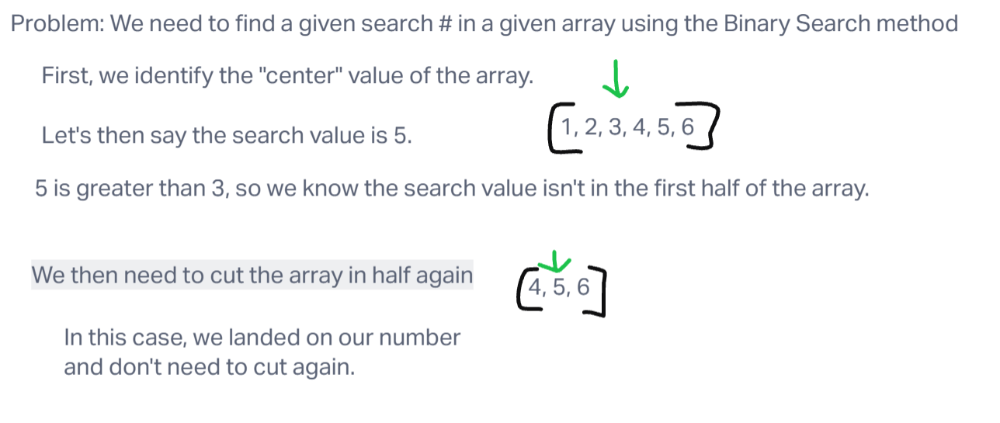

# Challenge Title
## Array Binary Search 

## Instructions
Write a function called BinarySearch which takes in 2 parameters: a sorted array and the search key. Without utilizing any of the built-in methods available to your language, return the index of the array’s element that is equal to the value of the search key, or -1 if the element is not in the array.

**NOTE:** The search algorithm used in your function should be a binary search.

## Whiteboard Process

## Approach & Efficiency

Start at the center of array. If the search number is less than that number, cut the array in half, and look in the center of that half. If it's greater, look in the second half of the array. Continue to cut the array in halves until you find the location of the search number.

## Solution
node index.js
