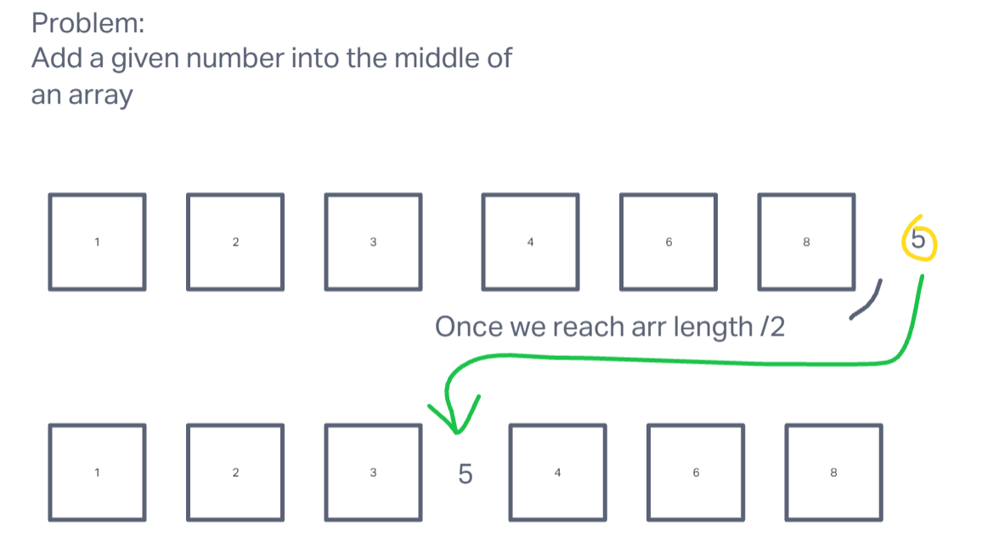

# Challenge Title
## Array Shift Insert 

## Instructions
Write a function called insertShiftArray which takes in an array and a value to be added. Without utilizing any of the built-in methods available to your language, return an array with the new value added at the middle index.

## Whiteboard Process

## Approach & Efficiency

Using length of array, copy array into new array. Loop through the array, and keep going while the loop index is lower than length divided by two. Once the index is greater than the length divided by two, add in the new value then continue until rest of array is copied into new array.

## Solution
node index.js