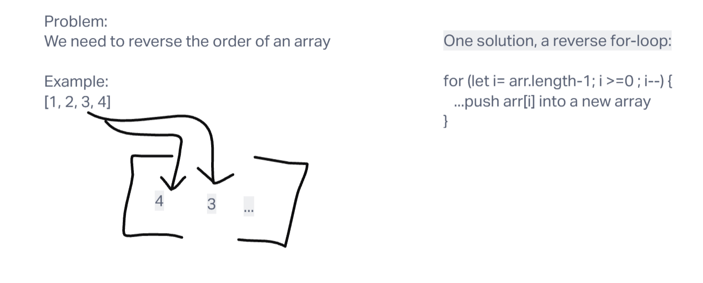

# Challenge Title
## Reversing an array

## Whiteboard Process

## Approach & Efficiency
### Option #1

Loop through the array in reverse - set i in a for loop to array.length-1, then i-- until we hit index 0.

### Option #2

Recursion - "pop" off the last value into a new array which accumulates all of the values.

## Solution
node index.js
