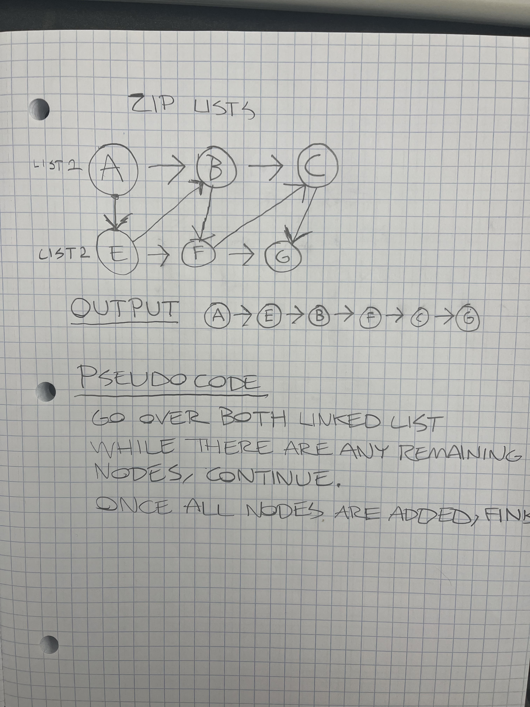

# Challenge Title
## Linked List Zip

## Instructions

Write a function called zip lists - zipLists(list1, list2)
Arguments: 2 linked lists

Return: New Linked List, zipped as noted below

Zip the two linked lists together into one so that the nodes alternate between the two lists and return a reference to the the zipped list.
Try and keep additional space down to O(1)
You have access to the Node class and all the properties on the Linked List class as well as the methods created in previous challenges.

## Tests
- Zip two lists of equal length
- Zip two lists of different lengths

## Whiteboard

## Solution
node index.js
