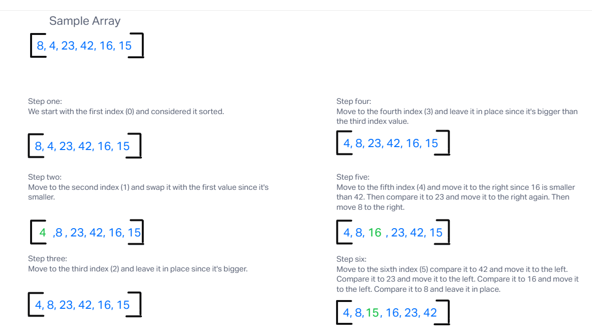

# Challenge Title
## Insert Sort

## Description
Selection Sort is a sorting algorithm that traverses the array multiple times as it slowly builds out the sorting sequence. The traversal keeps track of the minimum value and places it in the front of the array which should be incrementally sorted.

## Instructions
For each element of the input array, keep traversing the array and moving smaller numbers to the left until the array is in ascending order.

## Whiteboard
