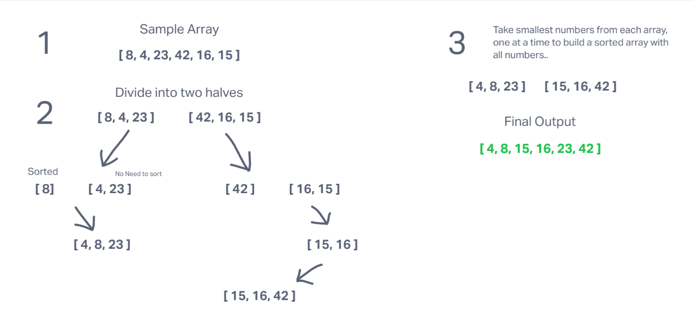

# Challenge Title
## Merge Sort

## Description
Merge Sort is a sorting algorithm that uses a "Divide, Conquer, Merge" strategy. First, an input array is divided into 2 arrays. Then each of those arrays are sorted. Then one array is merged into the other.

## Instructions
The initial array keeps getting split up until we have as many even/odd arrays as possible (i.e. arrays of 1 and 2)
At that point, we can being to merge them together in order of smallest to largest. 

## Whiteboard
