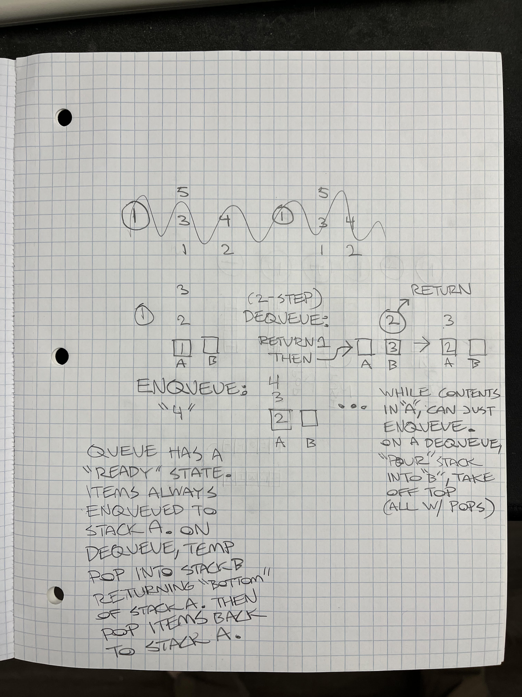

# Challenge Title
## Pseudo Queue

## Instructions

Using two Stacks as the underlying data storage mechanism, implement both a Pseudo Queue

### Pseudo Queue
- Internally, uses two Stacks for storage and management.

The class should contain the following methods:

**enqueue**
Arguments: value
adds a value to the start of the queue.

**dequeue**
Arguments: none
Returns: the earliest value enqueued, removing it from the queue.

## Tests
Can successfully enqueue into a queue
Can successfully enqueue multiple values into a queue
Can successfully dequeue out of a queue the expected value
Can successfully instantiate an empty queue

## Whiteboard

## Solution
node index.js
